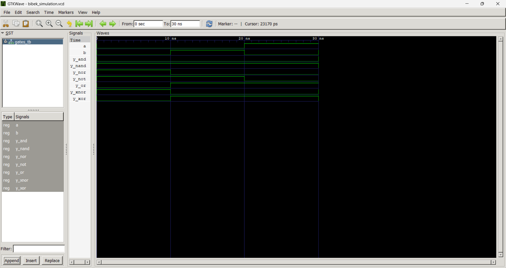

# Lab 2: VHDL Implementation and Verification of Basic Logic Gates

## Objective

The objective of this lab is to design and simulate the fundamental logic gates using VHDL and verify their functionality through waveform analysis using GTKWave.

The logic gates implemented in this lab are:

* AND gate
* OR gate
* NOT gate
* NAND gate
* NOR gate
* XOR gate
* XNOR gate

This lab helps to understand how basic digital logic circuits can be described using VHDL, tested using a testbench, and verified through simulation waveforms.

---

## Files Included

| File Name        | Description                        |
| ---------------- | ---------------------------------- |
| `and_gate.vhd`   | VHDL design file for AND gate      |
| `or_gate.vhd`    | VHDL design file for OR gate       |
| `not_gate.vhd`   | VHDL design file for NOT gate      |
| `nand_gate.vhd`  | VHDL design file for NAND gate     |
| `nor_gate.vhd`   | VHDL design file for NOR gate      |
| `xor_gate.vhd`   | VHDL design file for XOR gate      |
| `xnor_gate.vhd`  | VHDL design file for XNOR gate     |
| `gates_tb.vhd`   | Testbench file used for simulation |
| `simulation.vcd` | Generated waveform simulation file |
| `Output.png`     | Output waveform screenshot         |
| `README.md`      | Final lab report                   |

---

## Theory

Logic gates are the basic building blocks of digital electronics. They perform logical operations on binary input values and produce binary output values. These gates are used in almost every digital circuit, including adders, multiplexers, registers, memory units, and processors.

VHDL provides built-in logical operators that make it possible to describe the behavior of logic gates directly. After writing the VHDL code, the circuit can be simulated using a testbench to check whether the output matches the expected truth table.

---

## Basic Logic Gates

| Logic Gate | VHDL Operator | Boolean Expression | Description                              |
| ---------- | ------------- | ------------------ | ---------------------------------------- |
| AND        | `and`         | Y = A · B          | Output is 1 only when both inputs are 1  |
| OR         | `or`          | Y = A + B          | Output is 1 when at least one input is 1 |
| NOT        | `not`         | Y = A̅             | Output is the complement of input        |
| NAND       | `nand`        | Y = (A · B)̅       | Output is complement of AND operation    |
| NOR        | `nor`         | Y = (A + B)̅       | Output is complement of OR operation     |
| XOR        | `xor`         | Y = A ⊕ B          | Output is 1 when inputs are different    |
| XNOR       | `xnor`        | Y = (A ⊕ B)̅       | Output is 1 when inputs are same         |

---

## Truth Table

| A | B | AND | OR | NAND | NOR | XOR | XNOR |
| - | - | --- | -- | ---- | --- | --- | ---- |
| 0 | 0 | 0   | 0  | 1    | 1   | 0   | 1    |
| 0 | 1 | 0   | 1  | 1    | 0   | 1   | 0    |
| 1 | 0 | 0   | 1  | 1    | 0   | 1   | 0    |
| 1 | 1 | 1   | 1  | 0    | 0   | 0   | 1    |

For the NOT gate:

| A | NOT A |
| - | ----- |
| 0 | 1     |
| 1 | 0     |

---

## Implementation

Separate VHDL files were created for each logic gate. Each design file contains an entity and architecture that describe the behavior of the corresponding gate.

A common testbench file, `gates_tb.vhd`, was used to apply different input combinations to the gates. The testbench generated all possible input values so that the output of each gate could be observed and verified.

The simulation was performed using GHDL, and the waveform was viewed using GTKWave.

---

## Simulation Procedure

The simulation was completed using the following steps:

1. Write the VHDL code for each logic gate.
2. Create a testbench to apply input combinations.
3. Compile the design files using GHDL.
4. Compile the testbench file.
5. Run the simulation and generate a `.vcd` waveform file.
6. Open the waveform file in GTKWave.
7. Verify the output waveform with the truth table.

---

## Commands Used

```bash
ghdl -a and_gate.vhd
ghdl -a or_gate.vhd
ghdl -a not_gate.vhd
ghdl -a nand_gate.vhd
ghdl -a nor_gate.vhd
ghdl -a xor_gate.vhd
ghdl -a xnor_gate.vhd
ghdl -a gates_tb.vhd
ghdl -e gates_tb
ghdl -r gates_tb --vcd=simulation.vcd
gtkwave simulation.vcd
```

---

## Output

The simulation waveform generated using GTKWave is shown below:



The waveform shows the input and output behavior of the implemented logic gates. The output signals change according to the input combinations applied through the testbench.

---

## Observations

From the simulation waveform, the following observations were made:

* All possible input combinations were applied successfully.
* The AND gate produced high output only when both inputs were high.
* The OR gate produced high output when at least one input was high.
* The NOT gate produced the complement of the input.
* The NAND and NOR gates produced complemented outputs of AND and OR gates.
* The XOR gate produced high output when the inputs were different.
* The XNOR gate produced high output when the inputs were the same.
* The waveform output matched the expected truth table.

---

## Discussion

This lab provided practical experience in designing and verifying basic digital logic gates using VHDL. Each logic gate was described using VHDL logical operators, which made the design simple and clear.

The testbench was useful because it automatically applied different input values to the gates. Instead of checking the circuit manually, the testbench allowed the behavior of all gates to be verified through simulation.

GTKWave helped in visualizing the output signals over time. By comparing the waveform with the truth table, the correctness of each logic gate was confirmed.

This experiment also helped to understand the relationship between Boolean expressions, logic gate symbols, and their hardware description using VHDL.

---

## Conclusion

The basic logic gates AND, OR, NOT, NAND, NOR, XOR, and XNOR were successfully implemented using VHDL.

The designs were simulated using GHDL, and the output waveform was verified using GTKWave. The simulation results matched the expected truth tables, confirming that all logic gates were working correctly.

Overall, this lab improved understanding of basic digital logic design, VHDL coding, testbench creation, and waveform-based verification.

---

## Repository Structure

```text
Lab2/
├── README.md
├── and_gate.vhd
├── gates_tb.vhd
├── nand_gate.vhd
├── nor_gate.vhd
├── not_gate.vhd
├── or_gate.vhd
├── simulation.vcd
├── test.vhd
├── Output.png
├── xnor_gate.vhd
└── xor_gate.vhd
```
