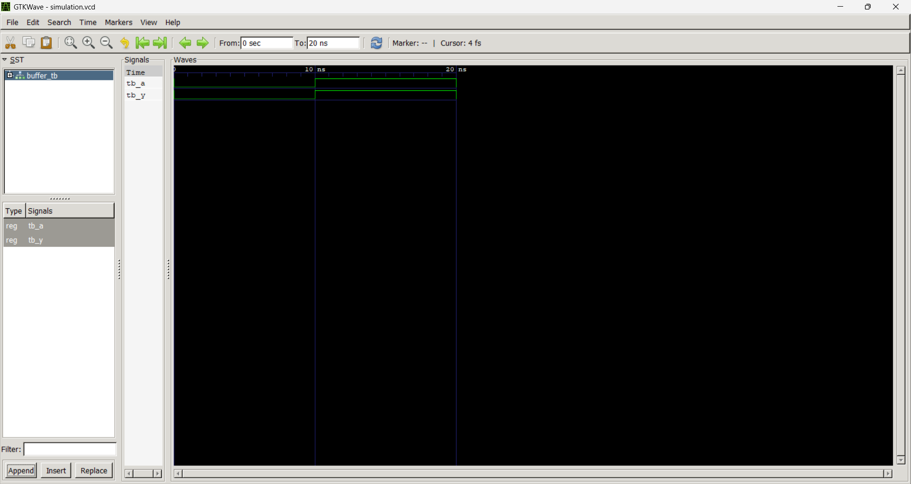

# Lab 1: Introduction to VHDL Programming and Open-Source Simulation Environment

## Objective

The objective of this lab is to set up and use an open-source VHDL development environment for writing, simulating, and verifying a basic VHDL program.

This lab helps to:

* Understand the basic structure of a VHDL program
* Learn the use of entity and architecture in VHDL
* Write a simple VHDL design file
* Create a testbench for simulation
* Generate a waveform file using GHDL
* View and verify the output using GTKWave

---

## Files Included

| File Name        | Description              |
| ---------------- | ------------------------ |
| `buffer.vhd`     | VHDL design file         |
| `buffer_tb.vhd`  | VHDL testbench file      |
| `simulation.vcd` | Simulation waveform file |
| `lab1.png`       | Output screenshot/image  |
| `README.md`      | Final lab report         |

---

## Theory

VHDL stands for **VHSIC Hardware Description Language**. It is a hardware description language used to describe and model digital circuits.

Unlike normal programming languages, VHDL describes hardware behavior. In digital hardware, many operations can happen at the same time. Because of this, VHDL supports concurrent execution, which means multiple signals and processes can work simultaneously.

A basic VHDL program usually contains the following parts:

1. Library declaration
2. Entity declaration
3. Architecture body

---

### Library Declaration

Libraries provide predefined data types and functions required in VHDL programs.

Example:

```vhdl
library IEEE;
use IEEE.STD_LOGIC_1164.ALL;
```

The `STD_LOGIC_1164` package provides the `std_logic` data type, which is commonly used to represent digital signals.

---

### Entity

The entity defines the external interface of the circuit. It contains the input and output ports.

Example:

```vhdl
entity buffer_gate is
    port (
        A : in std_logic;
        Y : out std_logic
    );
end buffer_gate;
```

Here:

* `A` is the input signal
* `Y` is the output signal
* `std_logic` represents a single digital signal

---

### Architecture

The architecture defines the internal working or behavior of the circuit.

Example:

```vhdl
architecture Behavioral of buffer_gate is
begin
    Y <= A;
end Behavioral;
```

In this example, the output `Y` follows the input `A`. This represents the behavior of a buffer circuit.

---

## Simulation Process

The VHDL design was simulated using **GHDL**, and the waveform output was viewed using **GTKWave**.

The general simulation steps are:

1. Analyze the design file
2. Analyze the testbench file
3. Elaborate the testbench
4. Run the simulation
5. Generate the `.vcd` waveform file
6. Open the waveform file in GTKWave

---

## Commands Used

```bash
ghdl -a buffer.vhd
ghdl -a buffer_tb.vhd
ghdl -e buffer_tb
ghdl -r buffer_tb --vcd=simulation.vcd
gtkwave simulation.vcd
```

---

## Output

The output waveform generated from the simulation is shown below:



The screenshot shows the signal behavior of the VHDL design during simulation. The waveform verifies that the output changes according to the applied input signal.

---

## Discussion

In this lab, a basic VHDL program was written and simulated using open-source tools. The design file described the actual digital circuit, while the testbench was used to apply input values and check the output behavior.

The simulation result was generated in the form of a `.vcd` file. This file was opened in GTKWave to observe the signal changes visually. By checking the waveform, the correctness of the circuit was verified.

This lab also helped in understanding the difference between software programming and hardware description. In VHDL, statements describe hardware behavior and can operate concurrently, similar to real digital circuits.

---

## Conclusion

This lab successfully demonstrated the basic workflow of VHDL programming and simulation.

From this lab, I learned how to:

* Write a simple VHDL design
* Create and use a testbench
* Compile and simulate VHDL code using GHDL
* Generate a waveform file
* View the output waveform using GTKWave

Overall, this lab provided a strong foundation for future VHDL-based digital design experiments.
